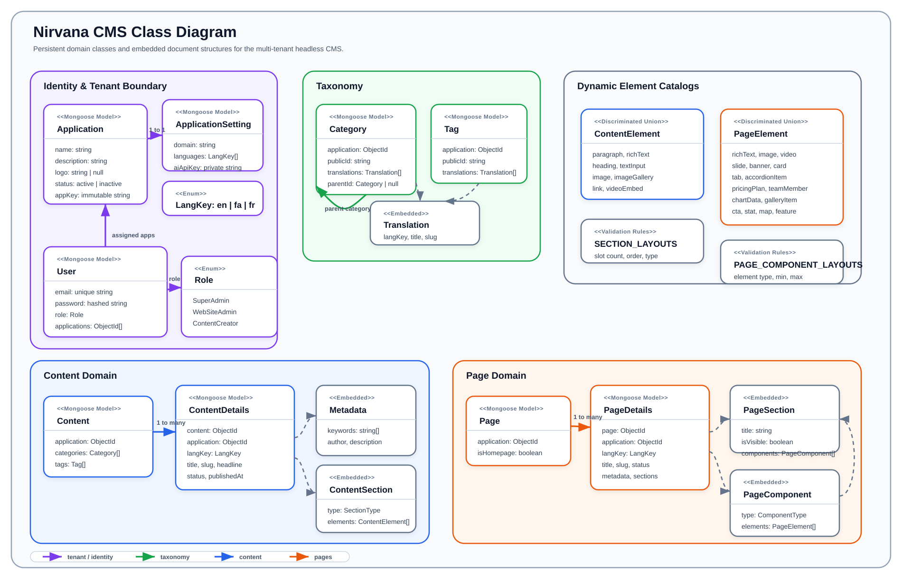

# Nirvana CMS Class Diagram

This document shows the main domain classes and relationships in Nirvana CMS. It focuses on the persistent model layer and embedded body/page structures that define how the CMS works.

## Reading Notes

| Area | Meaning |
| --- | --- |
| Identity & Tenant | `Application`, `ApplicationSetting`, and `User` define the multi-tenant boundary and role assignment model. |
| Taxonomy | `Category` and `Tag` are application-scoped, translated classification models. |
| Content | `Content` stores cross-language identity and taxonomy links; `ContentDetails` stores each language's title, slug, status, metadata, and dynamic body sections. |
| Pages | `Page` stores cross-language identity and homepage state; `PageDetails` stores each language's title, slug, status, metadata, and page layout sections. |
| Embedded Structures | Sections, components, metadata, translations, and elements are embedded document shapes inside the parent/detail documents. |

## Key Design Rules

- `Application` is the tenant boundary for almost every model.
- `ContentDetails` and `PageDetails` are language-specific records.
- `Category` and `Tag` use embedded translations instead of separate detail collections.
- Dynamic content uses section layouts with discriminated content elements.
- Dynamic pages use generic sections containing typed components, and each component owns discriminated page elements.
- Soft deletion is applied across persistent Mongoose models.
