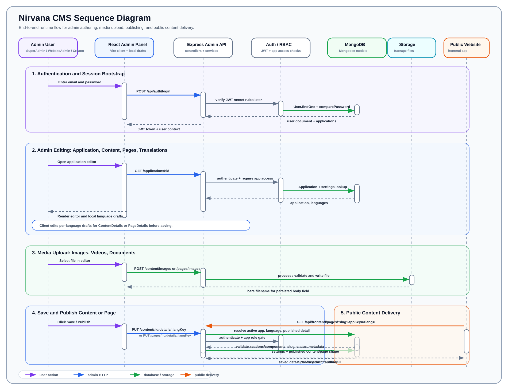

# Nirvana CMS Sequence Diagram

This document shows the main runtime flow through Nirvana CMS: authenticated admin work, multilingual content/page saving, media upload, publishing, and public content delivery.

## Flow Summary

| Phase | What Happens |
| --- | --- |
| 1. Authentication | Staff logs in through the React admin panel. The API verifies credentials, checks account status, and returns a JWT plus user/application context. |
| 2. Admin Editing | The admin panel loads the selected application and editor data. Editors work with local per-language drafts for content or pages. |
| 3. Media Upload | Uploaded files go through authenticated upload endpoints, then are saved under `/storage` as bare filenames. |
| 4. Save & Publish | The client saves changed language details. The API checks app access, validates sections/components, writes details, and stamps `publishedAt` when status becomes `published`. |
| 5. Public Delivery | A public frontend app calls `/api/frontend` with `appKey` and language. The API resolves the active application and returns only published content/pages. |

## Boundary Notes

- Admin routes require JWT authentication.
- Public delivery routes do not use JWT; they are scoped by `appKey`.
- Content and page save flows are similar and intentionally mirror each other.
- Draft authors can edit content/page details but cannot publish, delete, assign taxonomy, or set homepage status.
- Public responses are read-only and filtered to active applications plus published language details.
