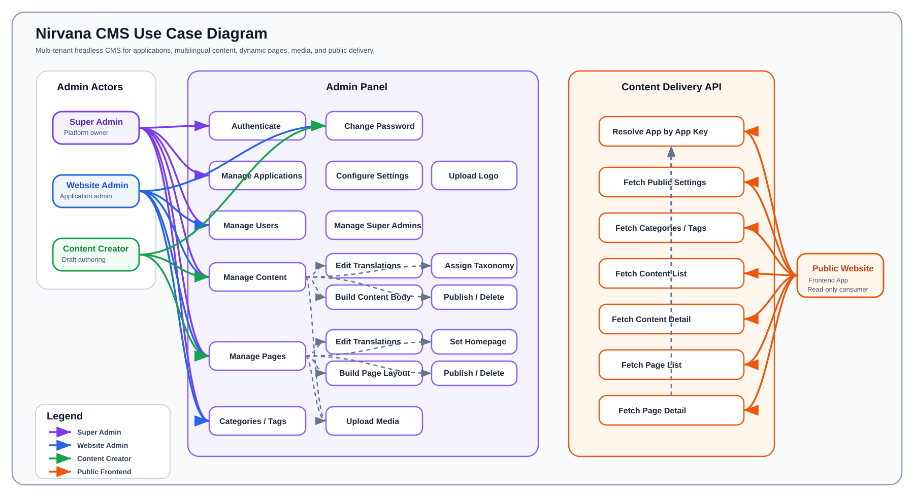

# Nirvana CMS Use Case Diagram

This document describes the primary actors and use cases for Nirvana CMS, a multi-tenant headless CMS where one admin panel manages multiple client applications.

## Actor Responsibilities

| Actor | Responsibility |
| --- | --- |
| Super Admin | Platform-level administrator. Manages applications, settings, super admins, users, content, pages, categories, tags, publishing, deletion, and homepage selection. |
| Website Admin | Application-level administrator. Manages assigned application's users, taxonomy, content, pages, publishing, deletion, and homepage selection. |
| Content Creator | Staff author for an assigned application. Creates and edits draft content/page translations and uploads media, but cannot publish, delete, assign taxonomy, or manage homepage status. |
| Public Website / Frontend App | External consumer of the public content delivery API. Reads only active application settings and published content/pages scoped by `appKey` and language. |

## System Boundary Notes

- Admin use cases require JWT authentication.
- Public delivery use cases are unauthenticated but must provide an application key.
- Content and pages are multilingual through per-language detail records.
- Content bodies are built from typed sections and elements.
- Page layouts are built from generic sections containing configurable components.
- Uploaded body media is stored as bare filenames; clients resolve the public `/storage/...` URL convention.
